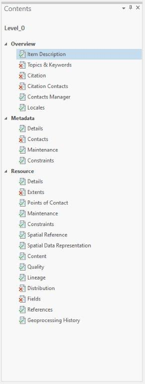

In this section we will go over how to add metadata to your items in ArcGIS Pro

# Adding metadata

Your data may not have any existing metadata descriptions for the fields that appear in your metadata editor. That's because either your data did not come with any metadata (if you're using data from an external source), or you have not included it for the data that you created.

Below are some metadata elements you should pay particular attention to when using ArcGIS Pro's ISO 19115-3 metadata style.

## Overview

### Item Description

This is where you'll want to add the most critical descriptive information about your data, such as title, abstract, summary, and credits.

### Topics and Keywords

Choosing an ISO topic category is mandatory for this style — click all that apply. With this element you can also add new discipline keywords, such as [CAB Direct](https://resources.library.ubc.ca/page.php?details=cab-direct&id=107) and [National Agricultural Library](https://agclass.nal.usda.gov/thesaurus-search), which Doug will also mention as for when you deposit into Dataverse. Additionally, place keywords using [Geonames](https://www.geonames.org/) can be useful in metadata for geospatial resources.

### Citation

The title will be automatically populated by ArcGIS Pro, but you should add a published date as well to record when the data was published.

### Citation Contacts

It is strongly recommended that you add yourself as an author to your data so that you can be the point of contact when others want to use your data later. **SAVE** your metadata after entering your information so that it can be loaded in other fields.

## Metadata

### Details

The Date Stamp is autoupdated by ArcGIS Pro, but you can adjust as needed.

### Contacts

Again, you may want to add yourself as a contact for the metadata in case you should be contacted with questions or updates. Load yourself as a contact using the information used in Citation Contacts.

## Resource

### Details

Here is where you can add high-level technical information about your dataset, including a status. Likely, MGEM capstone projects will be marked as **completed** or **on going**. Other elements in this section are automatically populated by ArcGIS Pro.

### Extents

You will want to add at least a description of the geographic extents of your dataset in this section, as well as a temporal extent (as a date or range). You may also want to consider adding bounding box extents of your item for improved machine readability outside ArcGIS Pro.

### Points of Contact

This is another area where your contact info can be loaded for reuse. It is highly recommended you add it here as well, in addition to the Contact Information you are able to share.

### Spatial Reference

This is automatically populated by ArcGIS Pro, but you should still be especially careful to make sure these elements are complete and accurate.

### Fields

In this section you can add information for each of your item's attributes where applicable. A good portion of this info is automatically populated, but you should add **Definition** and **Definition Source** where needed. The Definition Source should be used if your attribute values are classified using recognized systems (example: Koppen climate classification system).

## Save your metadata

You should save your data while working through the elements. Once you're ready, you can **save your changes from the Catalog's Metadata tab** to see your changes. Adding missing mandatory information will replace those red Xs with green checks.

If you're saving metadata for your Shapefiles, this method will also create an XML file which resides in the same directory as the remaining Shapefile sidecar files.
{: .note}
