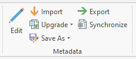

In this section we will go over how to export your metadata in ArcGIS Pro.

# Exporting metadata

Now that you have changed your metadata style and added additional information, you can export your metadata for use outside of ArcGIS Pro, such as for depositing into Dataverse alongside the rest of your research data collection.

_1_{: .circle .circle-red} In the **Catalog menu's Metadata section**, click on **Export**. Be sure you have selected the item you want to export metadata for in the Catalog Contents pane.

_2_{: .circle .circle-red} In the new modal window, save **Without Sensitive Information**

_3_{: .circle .circle-red} Export your data as the **Current style (ISO19115_3)**

_4_{: .circle .circle-red} Export your data to the same directory where your items is located. For example if you're saving the metadata describing a Shapefile, export to the same folder as the compressed .zip folder.

Once your metadata is exported, be sure to include it whenever you share or deposit your data.
