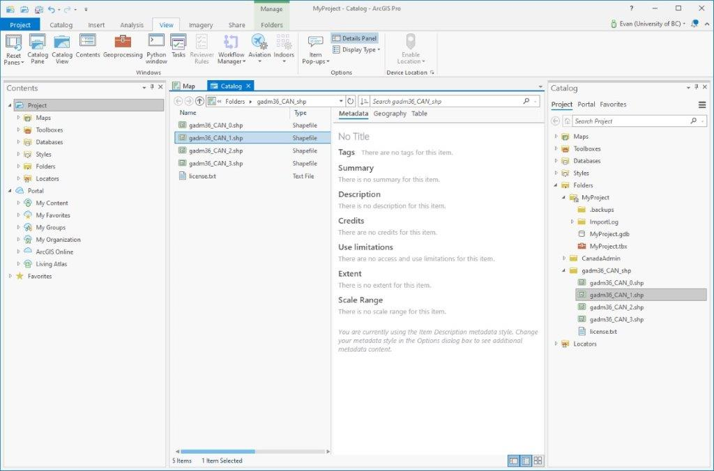
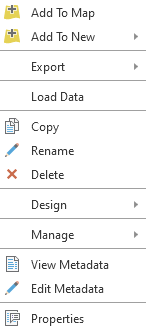

# Reviewing your metadata with ArcGIS Pro

Sometimes metadata can be hard to interpret without the use of a metadata editor and viewer. ArcGIS Pro has built-in metadata features which help you to create and edit metadata for your data, without having to spend time learning how to view and interpret it, as well as compile it into metadata standards. These features will make your file metadata workflows relatively easy upfront. Getting used to these workflows now could have major benefits for your data's usability in the future.

## POLL

Does anyone have, or has anyone added metadata for their items?

# ArcGIS Pro's metadata viewer

Metadata for an item (Shapefile, feature class, geodatabase, raster dataset, etc.) can be viewed using the Metadata Viewer in Catalog View. To enable the Catalog View pane in ArcGIS Pro, click **View > Catalog View**. In this example we're going to view the metadata for files and feature classes which exist outside of the default project geodatabase.

If you don't already have a folder connection to your data, you can add it by right-clicking **Folders > Add Folder Connection**.
{: .note}

To view an item's metadata, right-click the file and select **View Metadata**.

In the example we can see the item is missing a title, as well as these metadata fields:

- Tags
- Summary
- Description
- Credits
- Use Limitation
- Extent
- Scale Range

These fields represent the default ArcGIS metadata style Item Description, so in the next section we'll change this to reflect a more widely used metadata standard.

More information about viewing and editing metadata can be found using the ArcGIS Pro help documentation here: [https://pro.arcgis.com/en/pro-app/latest/help/metadata/view-and-edit-metadata.htm](https://pro.arcgis.com/en/pro-app/latest/help/metadata/view-and-edit-metadata.htm)
